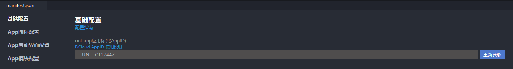
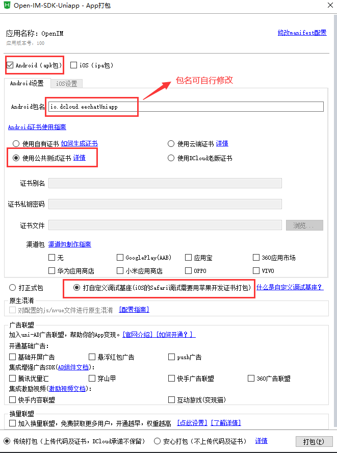
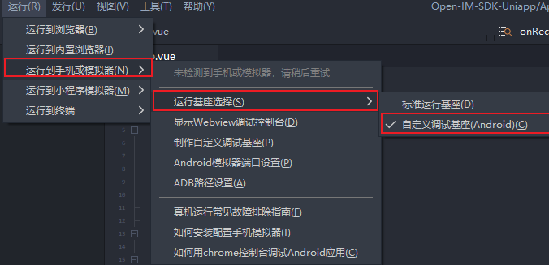

##  获取Demo

   可通过git clone或直接下载zip包方式获取

   - git方式

     ```bash
     git clone https://github.com/OpenIMSDK/Open-IM-Uniapp-Demo.git
     ```

- [zip下载](https://codeload.github.com/OpenIMSDK/Open-IM-Uniapp-Demo/zip/refs/heads/main)

## 安装依赖

   - 运行demo依赖node环境与npm工具

     ```bash
     npm install
     ```

   

## 修改配置

   - 可根据需要将App.vue文件initOpenIMSDK方法中的ipApi与ipWs修改为自己的服务器地址

     ```js
     const config = {
         platform: 1,	//平台类型
         ipApi: "http://1.14.194.38:10000",	//api域名地址
         ipWs: "ws://1.14.194.38:17778",	//websocket地址
         /**
         * ps:上述配置适合于通过ip访问  若通过域名且配置了https证书请使用如下配置方式
         * ipApi: "https://open-im.rentsoft.cn",
         * ipWs: "wss://open-im.rentsoft.cn/wss",
         */
         dbDir,	//SDK数据存放目录
     }
     //返回值为布尔值告知是否初始化成功
     this.flag = this.$openSdk.initSDK(config);
     ```
     
   - OpenIM账号体系[参考地址](https://doc.rentsoft.cn/server_doc/account.html)。若需要运行在自己的服务器上，您需要将Open-IM-Uniapp-Demo/utils/appServerApi.js中所有相关api更改为自己的服务器地址（一般为用户自身业务服务器地址，demo中的登录注册流程使用了我们自己的短信验证流程）。

     
     
   - 如有需要也可在manifest.json中重新获取个人uni-app应用标识（AppID）

     

## 生成自定义调试基座

   - 点击编译器（Hbuilder X）左上角导航栏：

     发行->原生App-云打包

     

## 运行到手机或模拟器

   - 等待Hbuilder X云打包完成后通过左上角导航栏：

     运行->运行到手机或模拟器->运行基座选择->自定义调试基座

     

   - 运行->运行到手机或模拟器（选择你的设备运行）

