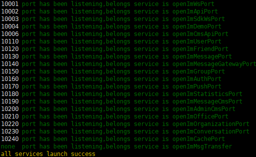

# 源码部署

## 服务器配置

> Linux系统 8G及以上内存  （目前仅支持linux下的部署，其他系统的部署需要自行修改脚本） 

## 安装组件

> Open-IM-Server依赖五大开源组件：**Etcd**、**MySQL**、**MongoDB**、**Redis**、**Kafka**，在使用源码部署Open-IM-Server 前，请确保五大组件已安装。如果没有安装以上组件，建议使用上文的docker部署。

#### 1.安装go语言环境

```bash
wget -c https://dl.google.com/go/go1.17.linux-amd64.tar.gz -O - | sudo tar -xz -C /usr/local
```
>**设置环境变量：**
>
>export PATH=$PATH:/usr/local/go/bin
> 
>source /etc/profile
>
>**开启go代理：**
>
>go env -w GO111MODULE=on
> 
>go env -w GOPROXY=https://mirrors.aliyun.com/goproxy/,direct


#### 2.克隆项目

```
git clone https://github.com/OpenIMSDK/Open-IM-Server.git --recursive
使用此命令拉取项目后，进入cmd/Open-IM-SDK-Core,使用git checkout main将Open-IM-SDK-Core子仓库切换到main分支下，然后进入cmd/Open-IM-SDK-Core/internal/sdk_advanced_function，同样使用git checkout main将sdk_advanced_function子仓库切换到main分支下

(注：如果项目中cmd/Open-IM-SDK-Core这个子模块无法正常拉取，文件夹为空，可前往https://github.com/OpenIMSDK/Open-IM-SDK-Core，获取最新tag，(Open-IM-SDK-Core项目下的internal/sdk_advanced_function如果为空，前往https://github.com/OpenIMSDK/sdk_advanced_function.git提取main分支下代码放置其中)放置于cmd/下，编译即可)
```

#### 3.修改config.yaml，配置五大组件的连接参数

```
cd Open-IM-Server
vim config.yaml
```

- 修改 Etcd 配置项

```
etcd:
  etcdAddr: [ 127.0.0.1:2379 ]
```

- 修改MySQL配置项

```
mysql:
  dbAddress: [ 127.0.0.1:3306 ]
  dbUserName: root
  dbPassword: openIM
```

- 修改MongoDB配置项

```
 mongo:
   dbAddress: [ 127.0.0.1:27017 ]
   dbUserName:
  dbPassword:
```

- 修改 Redis配置项

```
 redis:
  dbAddress: [ 127.0.0.1:6379 ]
  dbPassWord: openIM
```

- 修改 Kafka 配置项

```
kafka:
  ws2mschat:
    addr: [ 127.0.0.1:9092 ]
  ms2pschat:
    addr: [ 127.0.0.1:9092 ]
```

保存config.yaml退出即可。

每种RPC数量默认为1，如果需要调整RPC数量，修改config.yaml中的配置项rpcport对应的port信息，port个数代表对应rpc服务的进程数。比如openImUserPort: [ 10100,10101 ]表示本机会启动两个open_im_user，port分别为10100,10101

#### 4.构建

```
cd Open-IM-server/script
chmod +x *.sh
./build_all_service.sh
```

#### 5.启动

```
./start_all.sh
```

#### 6.检查

```
./check_all.sh
```



如图所示，表示正常启动。

