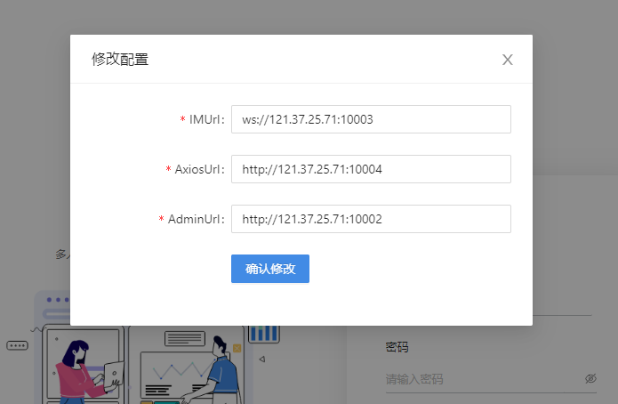

> **注意：** JSSDK需要连接的端口号为30000端口，除非服务端部署时自行修改了端口，否则无论在线测试还是开发测试都只需要将替换IP即可，无需修改端口号。
# 在线测试

- 测试地址 https://open-im-online.rentsoft.cn

- 测试方式：

  - 双击**在线化办公**打开配置选项

    

  - 修改配置中ip为自己已部署OpenIM Server的服务器IP，确认修改
  
    
  
  - 注册登录


# 环境要求

- node 14.17.5+

# 开发测试

- 拉取项目

  ```
  git clone https://github.com/OpenIMSDK/OpenMetaOffice-Electron.git
  ```

- 安装依赖

  ```
  npm install
  ```

- 修改配置

  - Web

    > 配置文件位置为：**src/config/index.ts**
    >
    > 项目默认配置地址为OpenIM测试服务器地址，若您已部署OpenIM-Server在自己的服务器上，需要修改为对应地址，否则可跳过此步骤。
    >
    > 项目默认使用腾讯云COS服务，可根据需求自行更改文件存储服务。
    
        //	注册服务地址
        export const AXIOSURL = "http://121.37.25.71:42233"
        //	axios请求超时时间
        export const AXIOSTIMEOUT = 60000
        //	OpenIM-Server JS SDK port
        export const IMURL = "ws://121.37.25.71:30000"
        //	获取cos临时密钥及调用管理员API地址
        export const ADMINURL = "http://121.37.25.71:10000"
        //	cos 缩略图格式配置
        export const PICMESSAGETHUMOPTION = "?imageView2/1/w/200/h/200/rq/80"
        //	默认语言
        export const LANGUAGE = "zh-cn"
    
  - Electron
  
    > 配置文件位置为：**electron/config/index.ts**
    >
    > **注意**：上方提到的配置文件也需要修改。
    
        // OpenIM-Server SDK API port
        export const openIMApiAddress = "http://121.37.25.71:10000"
        // OpenIM-Server SDK ws port
        export const openIMWsAddress = "ws://121.37.25.71:17778"
        // 客户端本地占用端口
        export const sdkWsPort = "7788"
    
     
    
    
  
- 运行调试

  - Web

     > 默认运行端口为3000

      ```
      npm run start:renderer
      ```
  
  - Electron
  
     > SDK本地需要占用一个端口（默认7788）
    
      ```
      npm run start:main
      ```


- 打包部署

  - Web

    > 打包生成文件在项目根目录build文件夹下，将文件夹内容上传服务器部署即可。

    ```
    npm run build:renderer
    ```
  - Electron

    > 打包生成exe和dmg安装程序在项目根目录dist文件夹下，运行即可。

    ```
    npm run build:main
    ```

    