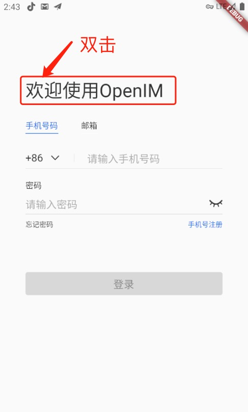
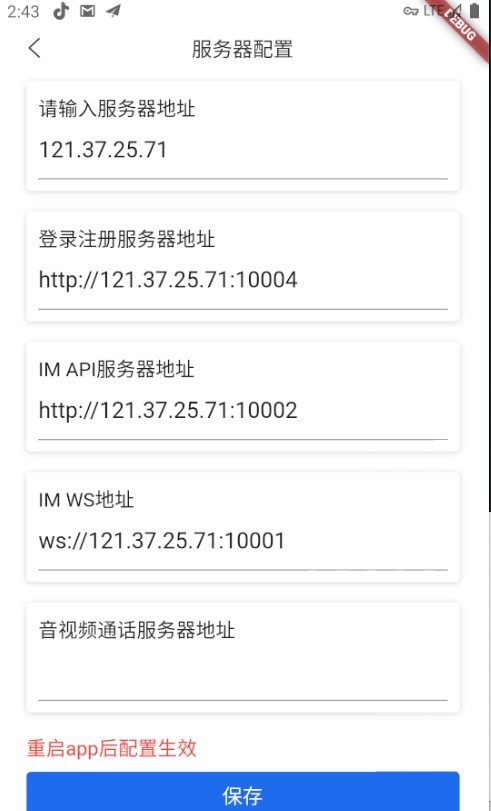

#### 直接下载app

可选择替换服务器地址为自己搭建的服务器地址，默认地址为官方服务器地址

#### 下载源代码

1. git clone https://github.com/OpenIMSDK/Open-IM-Flutter-Demo.git
2. 可选择修改 [config.dart](https://github.com/OpenIMSDK/Open-IM-Flutter-Demo/blob/master/lib/src/common/config.dart)文件里的服务器地址为自己搭建的服务器地址
3. 运行flutter pub get
4. 运行flutter run

#### 依赖说明

demo里使用的ui库链接：[flutter_openim_widget ](https://github.com/hrxiang/flutter_openim_widget.git)

demo使用的im库链接：[flutter_openim_sdk ](https://github.com/OpenIMSDK/Open-IM-SDK-Flutter.git)
