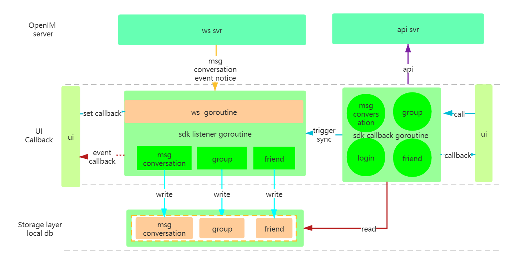
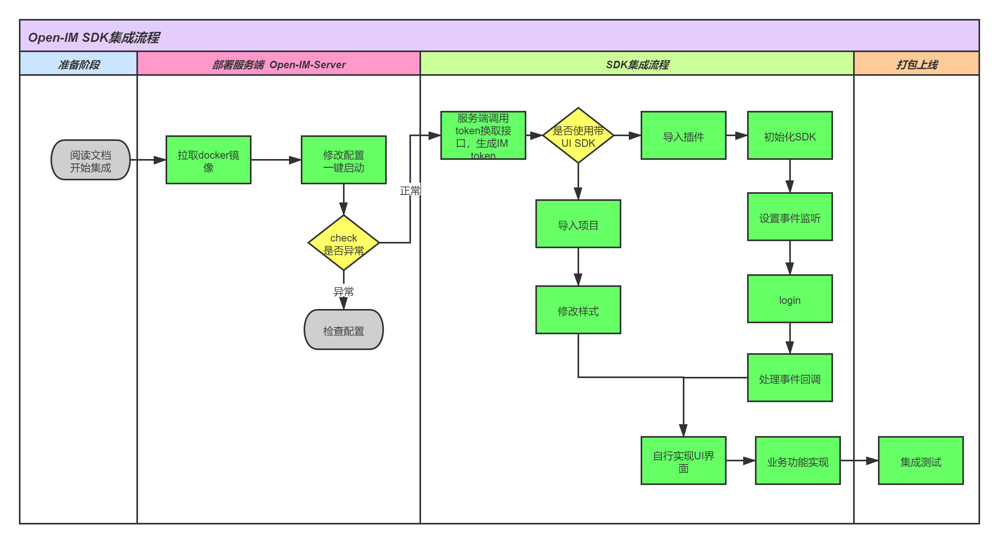

## 客户端架构介绍

客户端 SDK 负责和 IM 服务端交互，本地数据存储和同步，消息、事件回调。开发者通过集成 SDK，自行开发聊天界面 UI，设置事件监听回调实现数据和 UI 对接。

Open-IMSDK 分为三层：网络层、逻辑层、存储层。分层治理，各司其职，实现高效、稳定、统一的客户端架构。

（1）网络层：负责和服务端保持 websocket 连接、断网重连，接收消息推送，以确保在线时消息以及各种事件能实时达到。负责初始登录是、重连时数据补齐，通过对比本地 seq 和服务端最大 seq，同步拉取差值消息或事件，确保客户端和服务端达到最终一致的状态。

（2）逻辑层：针对主动调用接口和事件被动触发，对接网络层和存储层，实现业务细节，根据逻辑完成与 UI 之间的回调。比如发送消息，SDK 为 UI 提供发送消息及回调接口，逻辑层调用存储层存储本地消息，调用网络层发送消息，成功或失败回调 UI，并触发会话改变回调。同样接收消息或事件，网络层把消息或事件传给逻辑层，逻辑层根据消息或事件的类型做相应处理，比如存储本地消息，触发会话改变回调等。

（3）存储层：采用 sqlite 轻量级数据库，完成本地和服务端的数据同步，包括会话、消息、事件、通讯录、群组等，对外提供的数据 get 接口，通过本地数据库获取，实现了无网络情况下能查看消息等本地数据，同时也能有效缓解服务端的压力，达到了数据同步和缓存的双重目的。

## SDK 集成流程介绍

Open-IM SDK 集成非常简单，由于开发者私有化部署，代码、配置、数据都在自家服务器上，不用向云平台申请 AppKey 和 Secret，相比第三方 IM 云服务，可见 Open-IM 更安全、可控、自由度更高。
