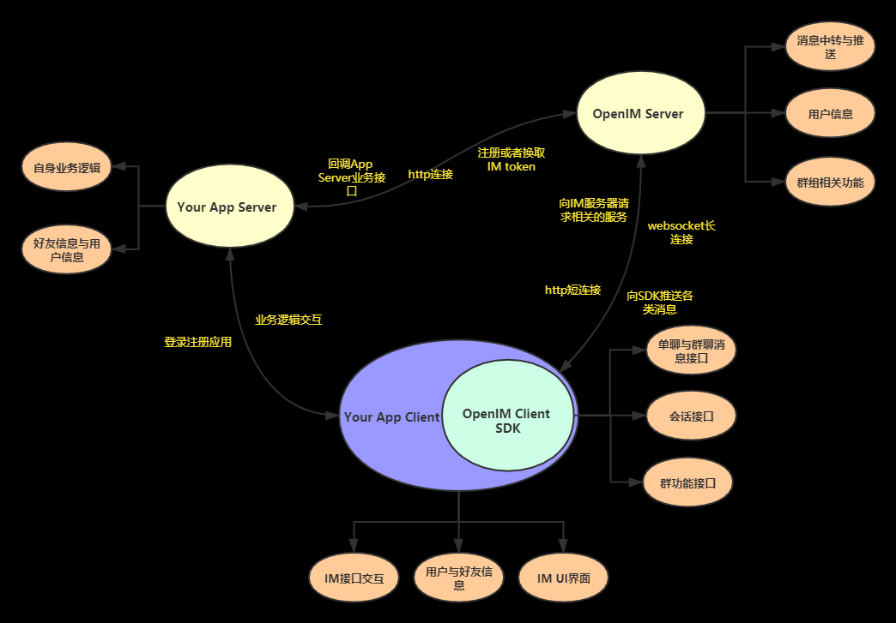
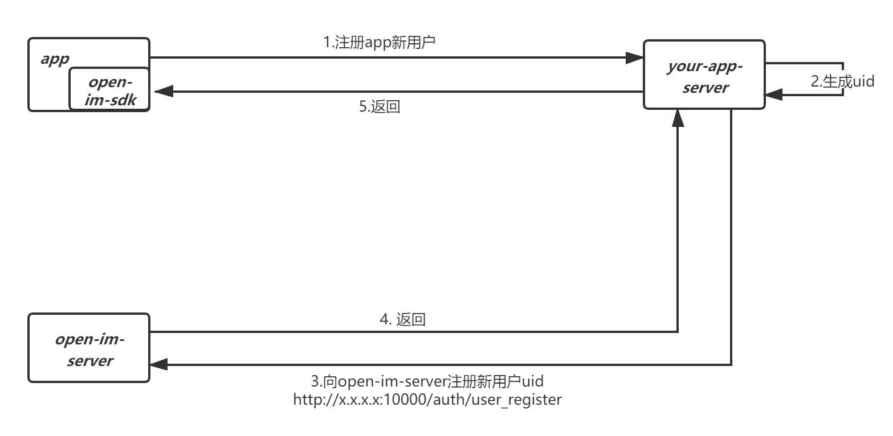
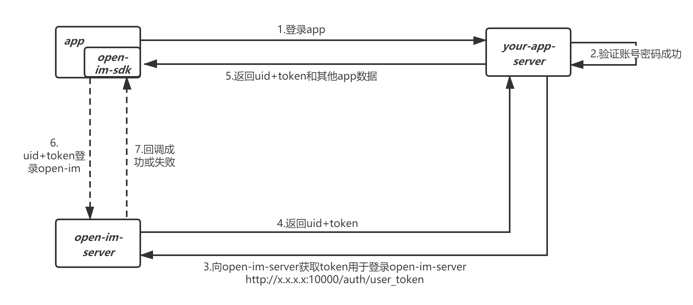

# AppServer、AppClient、Open-IM-Server以及Open-IM-SDK之间的关系

上图表示 AppServer、AppClient、Open-IM Server以及Open-IM-SDK 之间的关系。

- Open-IM即时通信提供了单聊、群聊、消息推送、安全鉴权等基本的IM功能、服务器端提供业务回调接口，在消息发送过程中回调用户的业务服务器，可以完成具体的业务功能，例如消息过滤，屏蔽等功能。

- Open-IM提供IM全托管服务，包括用户资料、好友关系、群组、消息、推送等功能。业务服务端只需要在用户注册、时调用Open-IMserver提供的获取token的接口，返回后，由app保存在本地，在下次登录时候携带token进行安全校验。客户端集成Open-IMSDK，仅仅需要调用初始化、加载会话等几个接口，无需更改原有App的架构，即可以完成带UI的IM全托管。

- 如果用户需要深度定制化开发，可以根据我们提供的OpenIM Client SDK接口，自定义开发，Open-IM客户端SDK是根据具体的常用的IM业务抽象而成，为了方便用户调用，我们尽力使其简洁、高效，而且易于扩展，方便用户能够根据自己的业务需求自定义消息。

- # Open-IM用户注册

- app注册新用户时，your-app-server完成与自身逻辑相关的验证后，生成uid；
- app-server 会携带 secret， platform， uid 等信息调用/auth/user_register接口完成open-im新用户注册；
- open-im-server检验信息后，给your-app-server返回成功，your-app-server给app返回成功；
- 对于app存量用户，直接批量调用/auth/user_register完成open-im新用户注册；
- 对于/auth/user_register具体请求响应字段，请参考服务端API文档； 

# Open-IM用户登录

- 用户登录app时，your-app-server先验证app账号密码，成功后调用/auth/user_token获取uid+token；
- your-app-server给客户端返回：uid+token+其他app数据；
- 客户端open-im-sdk带上uid+token登录open-im；
- 对于/auth/user_token具体请求响应字段，请参考服务端API文档； 

