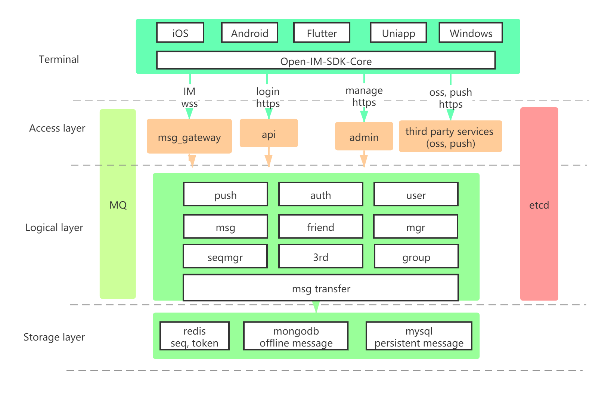

## IM 整体架构介绍

服务端由接入层、逻辑层和存储层组成，好处在于各个层次能够依据业务特点专注于自己的事情，提高系统复用性，降低业务间的耦合。

（1）接入层：消息通过 websocket 协议接入，其他通过 http/https 协议接入，消息是高频及核心功能，通过双协议路由，体现了轻重分离的设计思想。

（2）逻辑层：通过 rpc 实现无状态逻辑服务，易于平行扩展，消息通过 MQ 解耦。

（3）存储层：redis 存储 token 和 seq；mongodb 存储离线消息，并定时删除 14 天（可自行配置）前数据；mysql 存储全量历史消息以及用户相关资料。数据分层存储，充分利用不同存储组件的特性。

（4）Etcd：服务注册和发现、以及分布式配置中心。

## 消息架构介绍

Open-IM 消息模型采用经典的收件箱模型，并通过全局 seq 做消息对齐，这里带来架构的简化，体现了简单美的架构设计理念。很多开发者通过网络文章，了解到收件箱模型的原理，也知道 seq 的概念，但如何在项目中做权衡和取舍，爱因斯坦曾经说过“事情应该力求简单，不过不能过于简单”，我们看到很多技术文章对收件箱模型和 seq 的滥用，要么系统设计复杂，要么过于简单，最后的结果是系统不稳定，消息可达率无法达到要求。以下我们简单讲解消息如何发送，系统如何简单解耦，接收方如何实时收到消息，并如何利用 seq 做全局消息对齐，确保消息百分百可达。

（1）绿色箭头表示用户 A 给 B 发送消息流程：用户 A 发送消息，msg_gateway 进行消息拆分，并落地 MQ，MQ 根据 userId 写入不同的 partition 后返回给 A 成功，消息发送流程结束。

（2）蓝色箭头表示 A 给 B 发送消息后，服务端给 B 推送消息流程：msg_transfer 通过 MQ 消费者监听消息达到，通过 redis 增加 userId 对应的 seq，并把 seq 和消息关联后写入 mongodb，并异步写入 mysql，前者用于离线消息存储，比如用户不在线或者推送失败时同步消息使用，后者主要做历史消息备份，用于管理后台或其他用途。写入成功后，再调用 pusher 推送，根据 B 所连接的 msg_gateway，进行消息推送（由于网络波动或者 B 不在线等原因，可能会推送失败）。

（3）粉色箭头表示 B 主动同步和服务端差量消息流程：客户端在任何有重连动作（包括重新登录、网络波动等）发生时，首先会获取自身在服务端最大的 seq，和本地 seq 做差值对比，把差值消息通过接口主动拉取到本地，这样完成了本地和服务端消息对齐。

消息发送、消息对齐等与服务器交互的逻辑，我们通过 Open-IM-SDK 的方式提供给大家使用，简化了开发流程。
