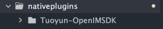
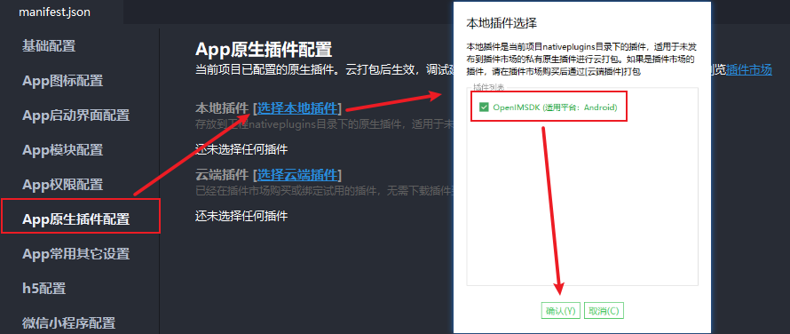

# 导入插件


## 离线导入方式

- 将资源包导入项目根目录nativeplugins目录下

  


- 在manifest文件中导入本地原生插件至项目中

  


## 云端插件导入方式

- DCloud插件市场搜索[OpenIM SDK](https://ext.dcloud.net.cn/plugin?id=6577)
- 点击购买for云打包
- 在HBuilderX里找到项目，在manifest的app原生插件配置中选择云端插件勾选模块


# 引入OpenIMSDK及globalEvent

```js
//OpenIMSDK
const openSdk = uni.requireNativePlugin('OpenIMSDK');
//globalEvent全局事件监听，处理监听回调
const globalEvent = uni.requireNativePlugin('globalEvent');
export {openSdk,globalEvent}
```

- 考虑到后续调用方便将OpenIMSDK及globalEvent导出并做了全局挂载，具体使用方式可自行决定。

  ```js
  //main.js
  import { openSdk,globalEvent } from 'utils/openSdk'
  Vue.prototype.$openSdk = openSdk
  Vue.prototype.$globalEvent = globalEvent
  ```

