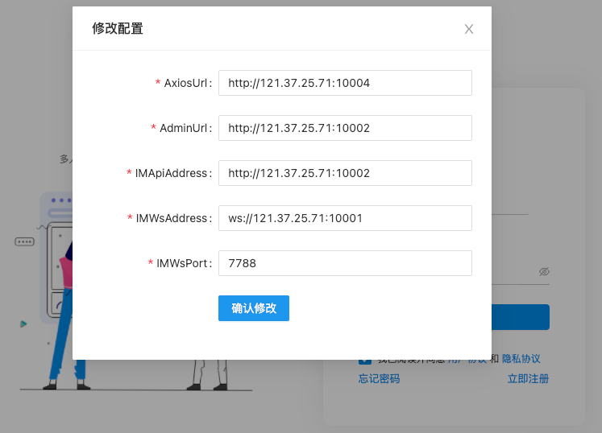
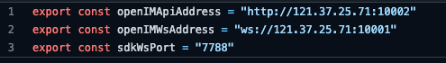

# 在线测试
> web版本可[点击此处](http://121.5.182.23:23232)前往[在线测试](http://121.5.182.23:23232)。

## 双击左侧标题 <u>在线化办公</u>


## 修改为自己服务器IP地址

> 注意，此处IP必须是外网IP，若服务端部署在本地或内网环境，则无法通过此方式进行测试。
>
> 配置信息参考下方，若未修改默认端口配置，则只需要将下方配置中IP改为自身服务端IP即可。


# 下载测试

## Electron应用下载

> 扫码或点击此处下载[window](https://qr02.cn/A82arJ)、[mac](https://qr02.cn/AeCvPV)，[更多前往](http://localhost:3000/#/demo/download_demo)


## 修改为自己服务器IP地址

> 同上述在线测试步骤，打开配置页。此处IP**不限制为**外网IP，服务端部署在本地或内网环境，也可通过此方式进行测试。
>
> 配置信息参考下方，若未修改默认端口配置，则只需要将下方配置中IP改为自身服务端IP即可。




# 下载源代码

## git方式下载

```bash
git clone https://github.com/OpenIMSDK/Open-IM-PC-Web-Demo.git
```

## 修改为自己服务器IP地址

### Web配置

> 配置信息参考下方，若未修改默认端口配置，则只需要将下方配置中IP改为自身服务端IP即可


### Electron应用配置

> 配置信息参考下方，若未修改默认端口配置，则只需要将下方配置中IP改为自身服务端IP即可
>
> 其中**sdkWsPort**为应用运行时在本地需要占用的端口号，若示例端口已被占用，自行修改为任一空闲端口即可。



## 运行项目

> **项目环境：**项目环境要求**Node版本14+**，**npm版本6+**。

1. 下载依赖

   ```bash
   npm install
   ```

2. 本地启动web调试

   ```bash
   npm run start:renderer
   ```

3. 本地启动electron调试

   ```bash
   npm run start:main
   ```

4. 打包web资源

   ```bash
   npm run build:renderer
   ```

5. 打包electron应用

   > **注意：**本命令默认同时打包win和mac下应用程序，但如果运行环境为win，则**不支持**跨端打包mac应用。

   ```bash
   npm run build:main
   ```

   


# 编译常见问题

1. demo运行环境要求？

   答：node版本14.x+   npm版本6.x+。

2. demo浏览器兼容性？

   答：目前未做针对性兼容，建议使用最新版本chrome浏览器进行调试开发。

3. electron依赖下载失败？

   答：国内下载资源容易失败，可以设置npm代理进行加速

   ```bash
   npm config set electron_mirror https://cdn.npm.taobao.org/dist/electron/
   ```

4. 'Draggable' cannot be used as a JSX component ？

   答：请将node_modules删除后使用npm拉取依赖。不要使用yarn等管理工具进行拉取。

5. electron应用支持哪些平台？

   答：目前已支持windows、mac，linux。

6. windows平台下打包electron应用失败？

   答：上述命令`npm run build:main`默认同时打包win和mac下应用程序，但如果运行环境为win，则**不支持**跨端打包mac应用。可以修改package.json中修改打包命令为`"build:main": "craco build && tsc -p electron && electron-builder --win"`，仅打包exe应用。
