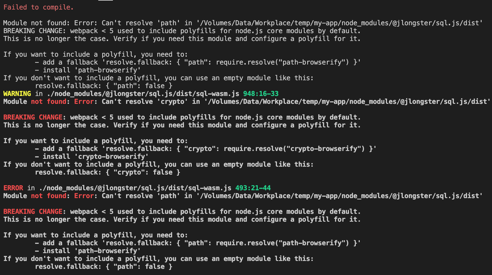

# webpack5+引入方式

## 1.获取npm包

- [npm包主页](https://www.npmjs.com/package/open-im-sdk-wasm-webpack5)

  ```bash
  npm install open-im-sdk-wasm
  ```

## 2.获取wasm所需静态资源

- 在项目根目录下的`node_modules`目录下找到`open-im-sdk-wasm`子目录，将其中`assets`文件夹下的所有文件拷贝到项目公共资源目录中（public）。

  > 文件清单

  ```bash
  openIM.wasm
  sql-wasm.wasm
  wasm_exec.js
  ```

  

- 并在您的index.html文件中通过`script`标签引入`wasm_exec.js`文件

## 3.在你的项目中引入SDK

- 引入SDK

  ```typescript
  import { getSDK } from "open-im-sdk-wasm";
  
  const OpenIM = getSDK();
  ```

  - 可能遇到的问题

    

    > 解决方案：在webpack配置中新增配置如下
    >
    > ```bash
    >   resolve: {
    >         fallback: {
    >           path: false,
    >           crypto: false,
    >         },
    >       },
    > ```


# vite或webpack4引入方式

> 第一、二步同上

## 3.在你的项目中引入SDK

- 将npm包中的`lib`目录拷贝到项目中，如：`src/utils/lib`。

- 修改`lib/api/index.js`文件中对web worker的引入方式。

  - Webpack4.x

    ```javascript
    + import IMWorker from 'worker-loader!./worker.js';
    
    - worker = new Worker(new URL('./worker.js', import.meta.url));
    + worker = new IMWorker();
    ```

  - vite

    ```javascript
    + import IMWorker from './worker?worker';
    
    - worker = new Worker(new URL('./worker.js', import.meta.url));
    + worker = new IMWorker();
    ```

- 引入SDK

  > 路径为拷贝后放置`lib`的路径

  ```javascript
  import { getSDK } from "@/utils/lib";
  
  const OpenIM = getSDK();
  ```


## 4.引入loader（webpack4）

> 这一步仅适用于webpack4引入，webpack5或vite可忽略

- 安装`worker-loader`和`worker-plugin`

  ```bash
  npm install worker-loader worker-plugin -D
  ```

- 在webpack中新增配置

  ```javascript
  const WorkerPlugin = require("worker-plugin");
  
  ...
  plugins: [new WorkerPlugin()]
  ...
  ```

  

# 常见问题

## 1.如何关闭wasm日志打印？

答：开发环境下为了调试可以打开wasm日志，可以在`wasm_exec.js`文件中找到`console.log(outputBuf.substr(0, nl));`取消注释

## 2.生产环境wasm包体过大？

答：生产环境建议启用gzip，wasm模块经压缩仅5Mb，且仅初次加载或有变动时才会进行全量加载。

## 3.我的开发环境对于以上引入方式都不适用？

答：目前官方仅提供几种常见编译工具的引入教程，若有使用其他编译工具的小伙伴可自行尝试引入，并欢迎向文档提供PR。