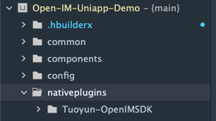
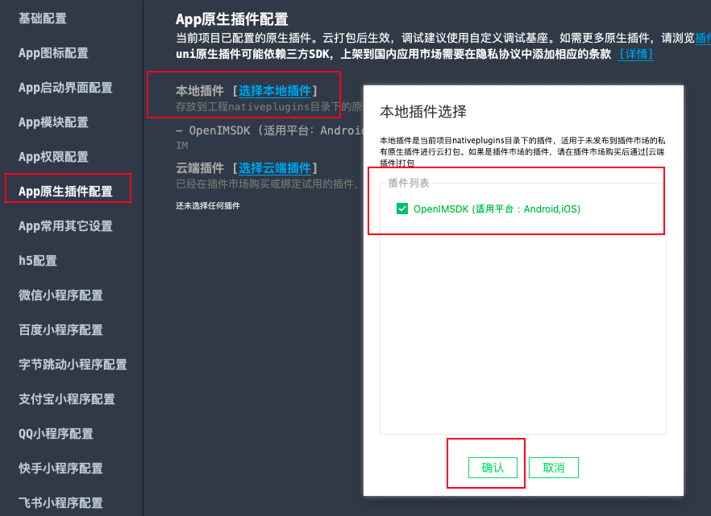
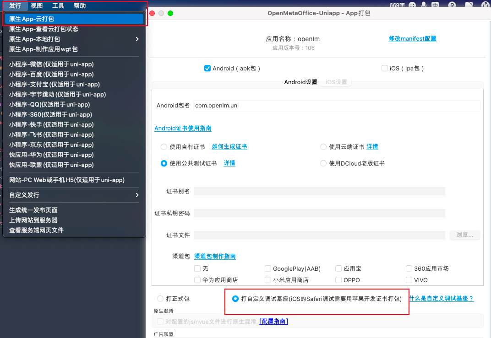
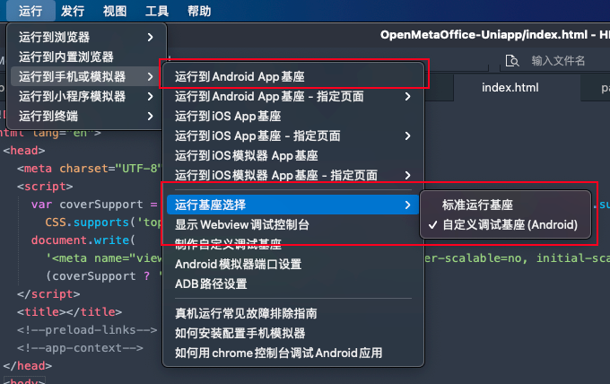
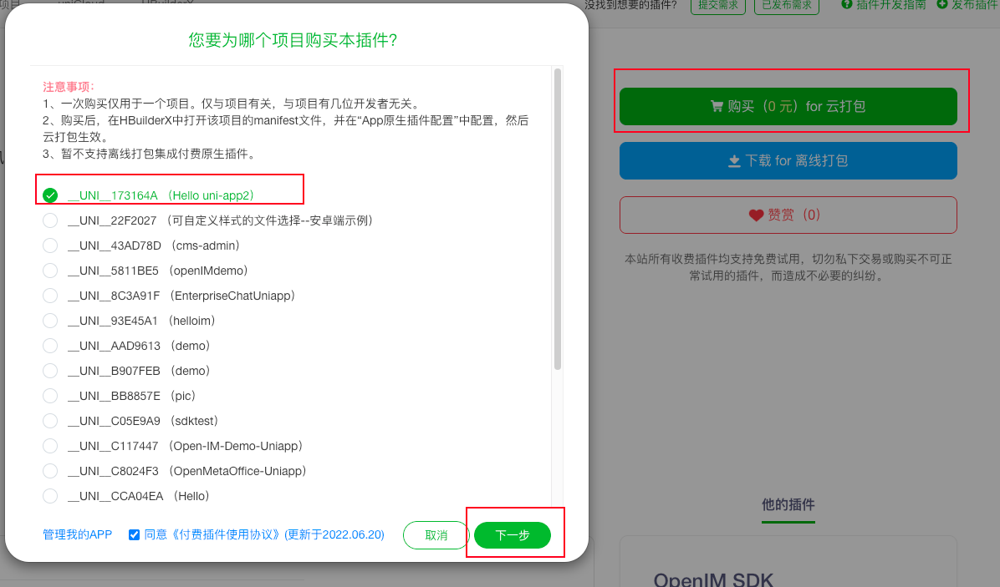
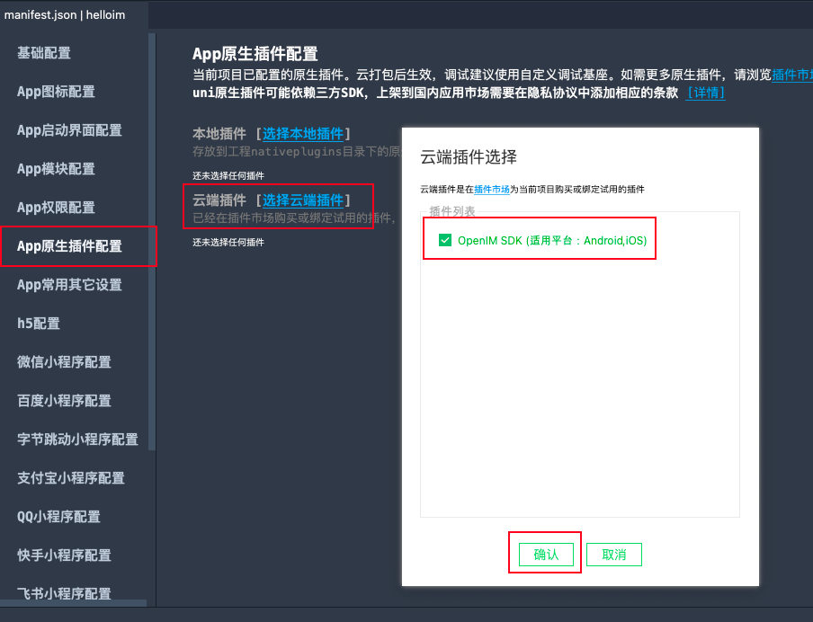

# 导入SDK

## 离线插件方式

1. 下载最新[离线插件](https://github.com/OpenIMSDK/Open-IM-SDK-Uniapp)

   ```bash
   git clone https://github.com/OpenIMSDK/Open-IM-SDK-Uniapp.git

2. 将下载下来的`Tuoyun-OpenIMSDK`文件夹整个放入uniapp项目根目录下的`nativeplugins`文件夹下（若没有该文件夹则新建）。

   

3. 打开uniapp项目根目录下`manifest.json`文件，打开**App原生插件配置**，选则本地插件进行导入。



4. 在项目中引入SDK及监听器。

   ```js
   const openIM = uni.requireNativePlugin("Tuoyun-OpenIMSDK");
   const event = uni.requireNativePlugin("globalEvent");
   
   export { openIM,event }
   ```

5. 项目云打包自定义调试基座。

   

6. 启动自定义调试基座

   > 需先选择运行基座为**自定义调试基座**

   


## 插件市场云插件方式

1. 在dcloud[插件市场](https://ext.dcloud.net.cn/plugin?id=6577)为uniapp项目绑定云插件。

   > 选择后需要绑定对应包名。

   

2. 打开uniapp项目根目录下`manifest.json`文件，打开**App原生插件配置**，选则云端插件进行导入。

   

3. 余下步骤同上[离线插件方式]()4-6。


# 初始化SDK

> 调用其他API之前必须先初始化SDK。

```js
im.initSDK(operationID, {											// operationID为随机字符串即可  用于定位问题
      platform: Platform,											// 平台号 参考通用结构中Platform
      api_addr: "http://121.37.25.71:10002",	// IM API地址
      ws_addr: "ws://121.37.25.71:10001",			// IM Ws地址
      data_dir:"data_dir", 										// SDK数据存放目录（绝对路径）
      log_level: 6,														// SDK日志级别
      object_storage: "minio",								// 图片等资源储存方式 目前支持"minio"、"cos"
    });
```


# 设置监听

> 设置监听的时机必须在初始化之后，登录之前。

```js
im.setUserListener();					// 用户相关监听
im.setFriendListener();				// 好友相关监听
im.setGroupListener();				// 群聊相关监听
im.setAdvancedMsgListener();  // 消息相关监听
im.setConversationListener(); // 会话相关监听
```


# 登录IM

> 必须等待登录成功回调之后才能调用其他API（除初始化和设置监听）  如获取好友列表等。

```js
im.login(
    operationID,	// operationID为随机字符串即可  用于定位问题
    userID,				// 用户ID
    token,				// 用户token
    (res) => {
      if (res.errCode !== 0) {
       // 登录失败
      } else {
        // 登录成功
      }
    }
  );
```

