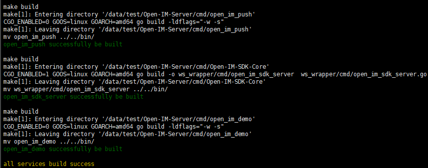

# 源码部署-单机

>> 简要说明：OpenIM系统依赖六大组件，在编译部署OpenIM之前需要保证其安装好(以下为官方使用的组件版本)
```
1、ETCD（version:{"etcdserver":"3.3.8","etcdcluster":"3.3.0"}）//服务注册与发现
2、MySQL(version:5.7)//用户业务信息以及管理后台查询消息使用
3、MongoDB(version:4.0.28)//线上消息存储
4、Redis(version:redis_version:7.0.0)//业务信息缓存，以及seq缓存
5、Kafka(version:kafka_2.13-2.8.1,依赖于组件zookeeper(version: 3.4.13-2d71af4dbe22557fda74f9a9b4309b15a7487f03))//消息队列，消息总线解耦
6、Minio(version:minio version RELEASE.2022-05-26T05-48-41Z)//私有化对象存储服务，用于图片、语音、文件等存储在自己的服务器中（注：如果使用三方云服务器存储媒体文件可不搭建）
```

## 1、服务器环境说明
 Linux系统 8G及以上内存  （目前仅支持linux下的部署，其他系统的部署需要自行修改脚本）

 获取OpenIM源码需要git环境，服务器如果没有需要安装git

 OpenIM server端开发语言为go语言，源码部署需要[搭建go语言环境](https://doc.rentsoft.cn/#/qa/docker?id=_1golang%e7%8e%af%e5%a2%83%e5%ae%89%e8%a3%85)

## 2、拉取项目源码
>>OpenIM-Server源码中包含两个仓库，一个是外部仓库/Open-IM-Server，一个是位于/Open-IM-Server/cmd/Open-IM-SDK-Core的子仓库（用于web端使用）
```
git clone https://github.com/OpenIMSDK/Open-IM-Server.git --recursive（注:如果服务器网络不好,或者没有vpn代理无法获取github代码,可以自行前往该地址,获取最新tag代码并上传到服务器）
使用此命令拉取项目后，进入cmd/Open-IM-SDK-Core,使用git checkout main将Open-IM-SDK-Core子仓库切换到main分支下
(注：如果项目中cmd/Open-IM-SDK-Core这个子模块无法正常拉取，文件夹为空，可前往https://github.com/OpenIMSDK/Open-IM-SDK-Core，获取最新tag代码，上传服务器到/Open-IM-Server/cmd/目录下)
```
## 3、修改配置文件参数
```
cd Open-IM-Server
vim config.yaml
```

- 修改 Etcd 配置项

```
etcd:
  etcdAddr: [ 127.0.0.1:2379 ]//组件部署在本地默认IP+监听端口即可，部署在其他服务器，更换为服务监听的IP+端口
```

- 修改MySQL配置项

```
mysql:
  dbAddress: [ 127.0.0.1:13306 ]//组件部署在本地默认IP+监听端口(部署的MySQL端口默认为3306，如果未修改，记得修改此项配置)即可，部署在其他服务器，更换为服务监听的IP+端口
  dbUserName: root //修改为部署的MySQL账户名
  dbPassword: openIM //修改为部署的MySQL密码
```

- 修改MongoDB配置项

```
 mongo:
   dbAddress: 127.0.0.1:37017 //组件部署在本地默认IP+监听端口即可，部署在其他服务器，更换为服务监听的IP+端口
   dbDatabase: openIM //mongo中初始化的数据库名称，可修改
   dbUserName:
   dbPassword:
```

- 修改 Redis配置项

```
 redis:
  dbAddress: [ 127.0.0.1:6379 ]
  dbPassWord: openIM #redis密码 修改为部署的redis密码
  enableCluster: false #如果外部redis以集群方式启动，需要打开此开关，单机默认
```

- 修改 Kafka 配置项

```
kafka:
    ws2mschat:
    addr: [ 127.0.0.1:9092 ] //组件部署在本地默认IP+监听端口即可，部署在其他服务器，更换为服务监听的IP+端口
    topic: "ws2ms_chat"
  ws2mschatoffline:
    addr: [ 127.0.0.1:9092 ] //组件部署在本地默认IP+监听端口即可，部署在其他服务器，更换为服务监听的IP+端口
    topic: "ws2ms_chat_offline"
  msgtomongo:
    addr: [ 127.0.0.1:9092 ] //组件部署在本地默认IP+监听端口即可，部署在其他服务器，更换为服务监听的IP+端口
    topic: "msg_to_mongo"
  ms2pschat:
    addr: [ 127.0.0.1:9092 ] //组件部署在本地默认IP+监听端口即可，部署在其他服务器，更换为服务监听的IP+端口
    topic: "ms2ps_chat"
```

- 修改 Minio配置项

```
minio:(如不使用minio存储可忽略)
    endpoint: http://127.0.0.1:10005 //minio外网ip 这个ip是给客户端访问的，如果服务搭建要对外，127.0.0.1替换为外网ip地址
    endpointInner: http://127.0.0.1:10005 //minio内网地址 如果im server 可以通过内网访问到 minio就可以填写
    endpointInnerEnable: true //是否启用minio内网地址 启用可以让桶初始化，IM server连接minio走内网地址访问，保持默认
    accessKeyID: user12345 //组件配置的id
    secretAccessKey: key12345 //组件配置的key
```

## 4、编译构建
```
cd Open-IM-server/script
chmod +x *.sh
./build_all_service.sh
```


如图所示，表示编译成功。

## 5、启动服务并检查

```
./start_all.sh; ./check_all.sh
```


如图所示，表示正常启动。

## 6、IM开放端口
| IM端口    | 说明                                    | 操作                                |
| --------- | --------------------------------------- | ----------------------------------- |
| TCP:10001（之前的17778端口） | ws协议，消息端口，比如消息发送，推送等。  | 端口放行或nginx反向代理，关闭防火墙 |
| TCP:10002（之前的10000端口）| api端口，比如用户、好友、群组等接口。     | 端口放行或nginx反向代理，关闭防火墙 |
| TCP:10003（之前的30000端口）| ws协议，针对jssdk的专用端口。           | 端口放行或nginx反向代理，关闭防火墙 |
| TCP:10004（之前的42233端口）| demo使用的用户注册登录端口。            | 端口放行或nginx反向代理，关闭防火墙 |
| TCP:10005（之前的9000端口）| 选择minio存储时需要开通。(openIM的demo默认使用minio存储) | 端口放行或nginx反向代理，关闭防火墙 |
| TCP:10006（之前的8000端口）| 管理后台api端口，需要管理后台服务时开通。 | 端口放行或nginx反向代理，关闭防火墙 |

注：如果使用nginx做反向代理，则只需要开放443端口即可。至此openIM的服务器已经搭建完毕，可通过[下载体验app修改IP](https://doc.rentsoft.cn/#/v2/validation/app)的方式访问验证。

# 源码部署-单机-更新代码
```
源码更新说明: openIM发布新的版本后，会更新项目文件到main分支下，除开源代码外，还有配置文件，config/config.yaml、文件会更新，用户如果修改过这个文件，在使用git pull可能会有冲突，需要自行备份，然后比对，解决冲突，重新放置到中config/。
```
## 1.关闭服务

```
cd Open-IM-Server/script ; ./stop_all.sh 
```
## 2.备份修改过的文件
```
config/config.yaml文件,可将其重命名为config_bak.yaml
```
## 3.拉取最新配置文件和源代码

```
git pull(注:可通过git branch -a 确保自己在main分支下)
```
## 4.修改配置文件冲突
```
config/config.yaml文件冲突，将备份文件config_bak.yaml和新版本config.yaml比对合并
```
## 5.重新构建编译

```
./build_all_service.sh
```

## 6.重新启动服务

```
./start_all.sh
```

## 7.检查

```
./check_all.sh
```